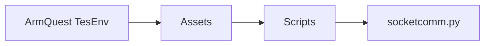

# ArmQuest

Codebase for EMG data acquisition and real-time analysis of ArmQuest, an EMG-based VR application for physical rehabilitation.

## Descriptoin
**`ArmQuest_emg`** - This file includes the serial EMG data acquisition, pre-processing, and processing.
**`ArmQuest_emg_ble`** - This file includes similar code to `ArmQuest_emg`, with the additional feature of wireless communication via BLE.
**`ble_test`** - This file includes the testing of BLE capabilities for whichever BLE microcontroller board is used.
**`socketcomm`** - This file includes the receiver for wireless BLE communication, as well as translating the received data into the appropriate movement in-game.

## Components
* MyoWare Muscle Sensor 2.0
* Arduino Nano 33 BLE / Arduino Nano ESP32
* Meta Quest 2 VR Headset
* Oculus Meta Link Application
* Unity Hub Application

## Setup
Place the MyoWare sensors on two muscles of your choice, and connect them to the Arduino.

### ArmQuest_emg or ArmQuest_emg_ble
* If using a serial connection (`ArmQuest_emg`), ensure your computer is not connected to a power source. Then run the program once ready.
* If using BLE functionality (`ArmQuest_emg_ble`), once the program is run, it is on standby.

### Oculus Meta Link
* Set up the headset with your Meta account and log in to the Link.
* Register the headset with the Link application.

### Unity Hub
* Download the Unity files from the Google Drive link provided in the text file, or [here](https://drive.google.com/drive/folders/1XIzdlkg6ml7fWGp7Hm1pq4_fglSDlj-3?usp=sharing).
* Add the project to the Unity Hub, and now it's available to open.

### socketcomm
* If using BLE, make sure to edit the `socketcomm.py` file with the correct MAC Address of the BLE microcontroller board used.
* If using serial, edit the `socketcomm.py` file to exclude BLE functionalities.
* It is located in:

## To Run
Connect Meta Quest 2 to your computer via the Meta Link app, and open the Unity project using the Unity Hub. Then, run the project in Unity play mode and start playing.

## Members
* David Purnomo
* Denise Tanumihardja
* Reece Zusy
* Tony Matusalem
